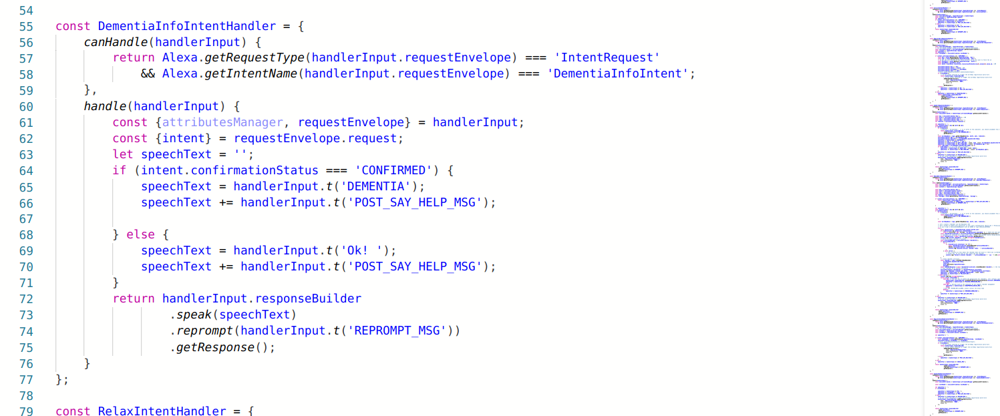

# Eclipse Color Editor Theme

 
 
 

  

 
 
 

  

 
 
I basically ported Eclipse syntax highlighting color scheme to VS Code.
I'm not affiliated with the Eclipse Foundation, and they have nothing to do with this extension.

I tested this extension with C++, Python, HTML, and XML. Some restrictions
in the syntax highlighting API prevent me from colorizing certain elements the way I want (e.g. C++ class members).

## Installation via VS Code

1. Open **Extensions** sidebar panel in VS Code. `View → Extensions`
2. Search for `Eclipse Color Editor Theme`
3. Click **Install** to install it
4. Click **Reload** to reload the editor
5. Code > Preferences > Color Theme > **Eclipse Color Editor Theme**

## Compile
./node_modules/vsce/out/vsce package
